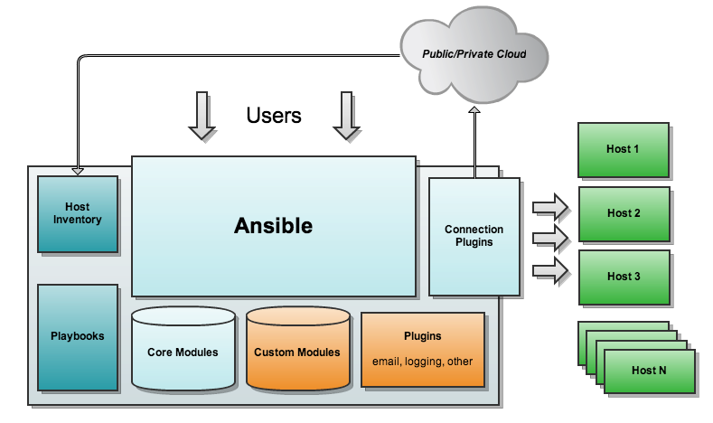
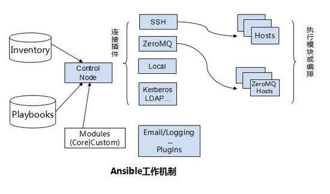

README
=============

受控主机环境
----------

| os_distribution | kernel_version | architecture | memory size | cpu |
| :- | :-: | :-: | :-: | :-: |
| CentOS release 6.10 (Final) Desktop | 2.6.32-754.10.1.el6.x86_64 | x86_64 | 8G | 4C |
| CentOS Linux release 7.6.1810 (Core) Desktop | 3.10.0-957.1.3.el7.x86_64 | x86_64 | 8G | 4C |

中控机环境
--------

| tools | version |
| :- | :- |
| ansible  | 2.7.8 |
| python | 3.7.2 |
| pip | 18.1 |
| brew | Homebrew 1.9.3 |
| mysql-client | 5.7.23 |
| MacOS Mojave | 10.14.1 |

TroubleShooting
---------------

> * 由于 github 对于上传的文件有大小现在，所以对于 源码文件包(*.tar.gz)/第三方软件(rpm) 则不予上传(.gitignore 中配置)，并在 各个 `roles` 的 `README.md` 中予以版本说明，附下载链接
> * 在 macOS 上可 执行 `/usr/bin/ruby -e "$(curl -fsSL https://raw.githubusercontent.com/Homebrew/install/master/install)"` 安装 homebrew
> * `scripts/ansible.cfg` 是 ansible 的一些配置重载
>
> * 在 Mac 环境下,会自动生成 .DS_Store 文件,为使全局忽略追踪该文件, 使用如下命令

```git
git rm -r --cached .
git add .
git commit -m 'update .gitignore'
```

> * 在打包复制迁移过程中，如果出现 `Linux 错误： $'\r': command not found` 说明是`windows` 下的 换行符在 `unix` 平台不认,使用如下命令转换
```解决方法
cd /path/to/ansible_tools
yum install dos2unix
find ./ -type f -exec dos2unix {} \;
```

> 在执行剧本过程中，如果提示模块(module) 的参数不认,例: `fatal: [127.0.0.1]: FAILED! => {"changed": false, "msg": "Unsupported parameters for (user) module: create_home Supported parameters include: append,comment,createhome,expires,force,generate_ssh_key,group,groups,home,local,login_class,move_home,name,non_unique,password,remove,seuser,shell,skeleton,ssh_key_bits,ssh_key_comment,ssh_key_file,ssh_key_passphrase,ssh_key_type,state,system,uid,update_password"}`
> 请升级 ansible 到指定版本

初始化 role 目录
---

``` shell
Usage:
    $ ansible-galaxy init --init-path=./roles/your_role_name
```

各个 role 的实现
---

* [apache](roles/apache/README.md)
* [common](roles/common/README.md)
* [docker](roles/docker/README.md)
* [elk](roles/elk/README.md)
* [ftp](roles/ftp/README.md)
* [haproxy](roles/haproxy/README.md)
* [mysql](roles/mysql/README.md)
* [nginx](roles/nginx/README.md)
* [php](roles/php/README.md)
* [python](roles/python/README.md)
* [redis](roles/redis-cluster/README.md)
* [squid](roles/squid/README.md)
* [tomcat](roles/tomcat/README.md)
* [zabbix_agentd](roles/zabbix_agentd/README.md)
* [zabbix_server](roles/zabbix_server/README.md)

Ansible Architecture
------------------




Author Information
------------------

欢迎发送邮件交流 ansible 的使用,邮箱为: <1318895540@qq.com>