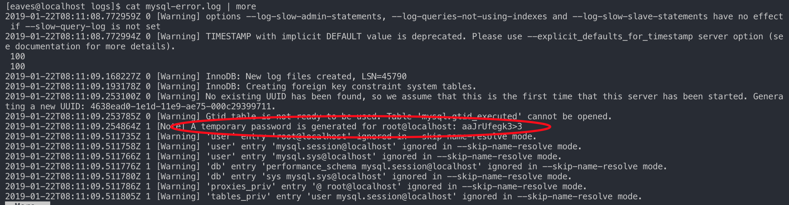

Role Name
=========

源码/包管理器 安装 mysql

Requirements
------------

source version | download url |
:- | :- |
boost_1_59_0.tar.gz | <https://nchc.dl.sourceforge.net/project/boost/boost/1.59.0/boost_1_59_0.tar.gz> |
mysql-5.7.24.tar.gz | <http://ftp.ntu.edu.tw/MySQL/Downloads/MySQL-5.7/mysql-5.7.24.tar.gz>|
mysql-5.7.24-linux-glibc2.12-x86_64.tar.gz | <http://ftp.ntu.edu.tw/MySQL/Downloads/MySQL-5.7/mysql-5.7.24-linux-glibc2.12-x86_64.tar.gz>|

> 说明: 如果采用源码编译安装,则 `mysql5.7` 之后的版本需要 `boost` 对应的版本相支持, 请使用者自行测试 版本对应关系。
> 关于 mysql 的相关优化，请使用者自行设置，本剧本只进行安装和配置文件配置

Role Variables
--------------

均在文件 `inventory/group_vars/all.yaml` 和 `./defaults/main.yaml` 中设置 

Dependencies
------------

需要局域网目标机器具有访问公网的能力, 如果需要，请设置 `dependencies_common` 为 `true`

> 说明:
> * `mysql_user` 和 `mysql_db` 模块依赖 `PyMySQL`
>   * `brew install mysql-client`
>   * `pip3 install PyMySQL`

Example Playbook
----------------

Including an example of how to use your role (for instance, with variables passed in as parameters) is always nice for users too:

    - hosts: database
      remote_user: ansible_ssh_user
      become: yes
      become_method: su
      gather_facts: True

      roles:
        - role: mysql
          tags: mysql

    ``` shell
    $ cd scripts
    $ INVENTORY=../inventory/hosts.ini ./deploy_mysql.sh
    ```

  > 说明: 当执行 `"{{ mysql_install_dir }}/bin/mysqld --initialize --user={{ mysql_user }} --basedir={{ mysql_install_dir }} --datadir={{ mysql_data_dir }}"` 初始化 `mysql` 数据目录后，会在 `logs/mysql-error.log` 中生成 root的 临时密码

  

  > `ERROR 1820 (HY000): You must reset your password using ALTER USER statement before executing this statement.`
  >  ```shell
  >  mysql> alter user 'root'@'localhost' identified by '!Q2w3e4r5t6y';
  >  ```

License
-------

BSD

Author Information
------------------

欢迎发送邮件交流 ansible 的使用,邮箱为: <1318895540@qq.com>